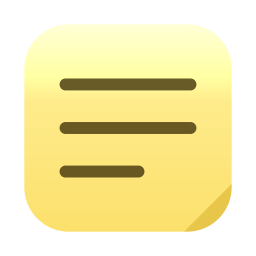

# Stickies

Sticky notes for iOS and macOS that live as plain markdown files in a folder
you choose — so you can put that folder in iCloud Drive, Dropbox or Google
Drive and have the same stickies on every device. Pin any note to your Home
Screen, desktop or Lock Screen with a widget.

<p align="center">
  
</p>

## What it does

- **Notes are files.** One `.md` file per sticky, in a folder you pick. Edit
  them in Stickies, in Obsidian, in TextEdit, or over SSH — the app keeps up.
- **Always in sync with the folder.** A directory watch catches local edits
  immediately; a background poll catches files that a cloud service
  materialises without an event. Nothing is cached as the source of truth.
- **Markdown, rendered.** Headings, bold/italic, links, bullets, numbered
  lists, task lists, quotes, code and rules — in the app *and* in the widgets.
- **400 characters.** Enough for a real note, short enough to stay legible in
  a widget. Longer files that arrive from elsewhere are shown and flagged, not
  truncated.
- **Six classic sticky colours**, stored in the file so they travel with it.

### Widgets

| Widget | Sizes | What it shows |
| --- | --- | --- |
| **Sticky Note** | small, medium, large (+ extra large on macOS) | One note, filling the widget |
| **Two Stickies** | small, medium, large (+ extra large on macOS) | Two notes stacked with a gap, at a smaller text size |
| **Sticky on the Lock Screen** *(iOS)* | inline, rectangular | One note, shrunk until as much text as possible fits |

Each widget is configured by long-pressing it and choosing **Edit Widget**,
then picking which sticky it should show.

The Lock Screen widget renders in the system's single-tint mode, so sticky
colour is deliberately dropped there and the space goes to text instead. The
inline family is the strip directly above the clock; the rectangular family is
the larger slot below it.

## Building it

Requirements: **Xcode 15 or later**, iOS 17+, macOS 14+.

**The project does not build as checked out** — the placeholder identifiers are
fake on purpose, and Apple won't register `com.example.*` to anybody. Step 2 is
mandatory.

1. Open `Stickies.xcodeproj`.
2. Open `Config/Base.xcconfig` and replace the placeholders:

   ```
   DEVELOPMENT_TEAM = ABCDE12345
   APP_BUNDLE_ID    = com.yourname.stickies
   APP_GROUP_ID     = group.com.yourname.stickies
   ```

   `APP_BUNDLE_ID` just has to be unique to you — it doesn't need to be a domain
   you actually own. `APP_GROUP_ID` must start with `group.`. To keep your own
   identifiers out of git, put the same settings in `Config/Local.xcconfig`
   instead; it's ignored by git and included last, so it wins.
3. Register the App Group (see below).
4. Pick the **Stickies** scheme and run on an iOS or macOS destination.

Everything else — both bundle identifiers, both platforms' entitlements, the
widget extension's Info.plist — is derived from those values, so there is
nothing else to keep in sync.

### Registering the App Group

The App Group is how the widget extension finds the folder bookmark and the
cached note list. Without it the app itself works fine and every widget comes up
blank — Settings ▸ Widgets tells you whether the group is resolving.

Easiest path, per target (**Stickies** *and* **StickiesWidgets**):

1. Select the target ▸ **Signing & Capabilities**.
2. The **App Groups** section is already there, populated from the entitlements
   file. Tick your group, or hit the refresh arrow if Xcode shows it as
   unregistered — Xcode will create it and add it to both App IDs.

If Xcode won't do it, create it by hand at
[developer.apple.com ▸ Identifiers ▸ App Groups](https://developer.apple.com/account/resources/identifiers/list/applicationGroup),
then enable the **App Groups** capability on both the `com.yourname.stickies`
and `com.yourname.stickies.widgets` App IDs and select the group in each.

> **macOS App Group naming.** macOS requires the team ID as a prefix
> (`ABCDE12345.group.…`) while iOS forbids it. The xcconfig builds both forms
> and hands the right one to each platform's entitlements and Info.plist, so
> you only ever type the `group.…` form. Xcode reports the fully-qualified
> `TEAMID.group.…` name in signing errors on both platforms; that's just how
> the portal names it, not a sign that the wrong form was used.

### If the build fails

| Error | Cause |
| --- | --- |
| `The app identifier "com.example.stickies" cannot be registered to your development team` | Step 2 wasn't done. `com.example.*` can't be registered by anyone. |
| `No profiles for 'com.example.stickies' were found` | Same cause — the App ID doesn't exist, so there's nothing to make a profile from. |
| `Provisioning profile … doesn't support the ….group.… App Group` | The App Group isn't registered, or isn't enabled on that target's App ID. See above — it has to be on **both** the app and the widget. |
| `Disabling hardened runtime with ad-hoc codesigning` | Only a note, not an error. It appears on macOS when no team is set yet. |

None of this is about the name **Stickies** — it isn't reserved, and the target
name doesn't collide with the Stickies app that ships with macOS (that one is
`com.apple.Stickies`). If you'd rather not share the name anyway, set
`APP_DISPLAY_NAME` in the xcconfig; it changes the name under the icon without
touching the project.

## How a note is stored

A note is just markdown. Anything Stickies adds goes in optional front matter,
so a file written by hand is a perfectly valid sticky:

```markdown
---
color: yellow
created: 2026-08-25T09:41:00Z
---
# Milk
- oat
- **not** skim
```

- `color` — one of `yellow`, `pink`, `blue`, `green`, `orange`, `purple`.
  Missing? A colour is derived from the file name, stably.
- `created` — ISO 8601. Missing? The file's creation date is used.
- Front matter keys Stickies doesn't recognise are preserved on save, so other
  tools can annotate the same files.
- The note's **title** is its first meaningful line, with markdown stripped.
- `.md`, `.markdown`, `.txt`, `.text` and `.mdown` files are all picked up.
  Sub-folders are ignored — a board is one flat folder.

A new note's file is named after its first line the first time you type one,
and never renamed behind your back after that. Renaming is explicit, under
**Rename File…**.

## How it fits together

```
Config/Base.xcconfig     Team, bundle ID and App Group — the only things to edit

Shared/                  Compiled into both the app and the widget extension
  Model/                 Note, sticky palette, the file format
  Storage/               Folder bookmark, coordinated file IO, folder watcher,
                         widget snapshot cache, the app's observable store
  Markdown/              Block parser and its SwiftUI renderer
  UI/                    The sticky itself — used by widgets and by the app's
                         live preview, so they can't drift apart

App/                     SwiftUI app: onboarding, list, editor, settings
Widgets/                 Widget bundle, AppIntents note picker, three widgets
Tools/                   Project and icon generators
```

Two details worth knowing:

- **File access.** The folder is reached through a security-scoped bookmark
  stored in the App Group. Every read and write goes through `NSFileCoordinator`
  so a cloud provider writing from another device and the app reading take
  turns rather than colliding.
- **Widgets read the folder first**, and fall back to a JSON snapshot the app
  leaves in the App Group container. That fallback is what keeps widgets
  populated when the extension can't resolve the bookmark itself or the cloud
  files aren't downloaded yet.

### Regenerating the project

`Stickies.xcodeproj` is generated and committed. After adding, removing or
moving files:

```sh
python3 Tools/generate_xcodeproj.py
```

Object IDs are hashes of each object's role, so an unchanged project
regenerates byte-identically. The app icon is generated too — `python3
Tools/generate_icons.py` redraws it after a palette change. Neither script
needs any third-party packages.

## Known limits

- A widget remembers a note by file name. Rename a file outside the app and
  the widget falls back to matching on title; if that fails too, the widget
  says so and asks you to pick the note again.
- Widgets refresh when you edit a sticky on that device, and roughly every 15
  minutes otherwise. A change made on another device appears at the next
  refresh, not instantly — that's a WidgetKit budget, not a choice.
- Two devices editing the same note at the same moment is last-write-wins at
  the file level. The app detects a file changing underneath an open editor
  and asks which version you want rather than silently picking one.
